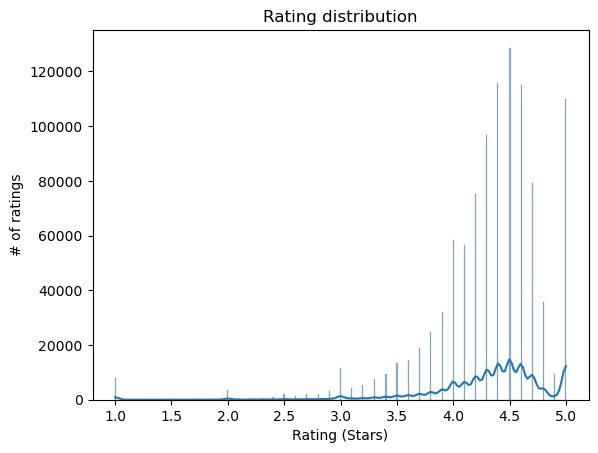
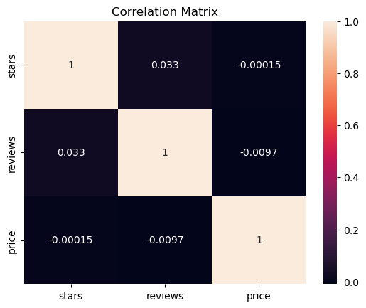
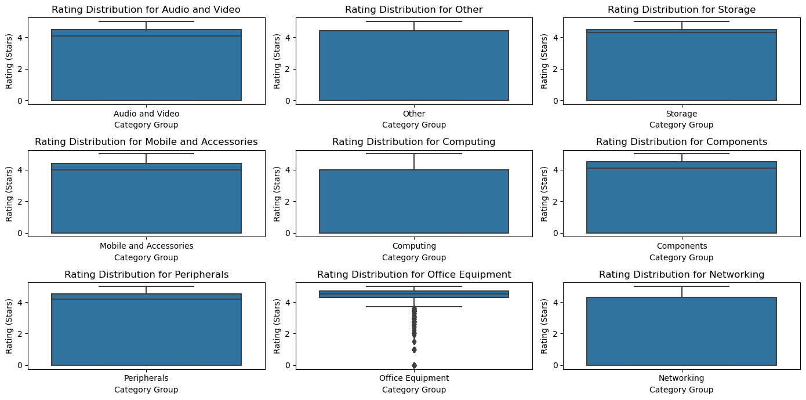
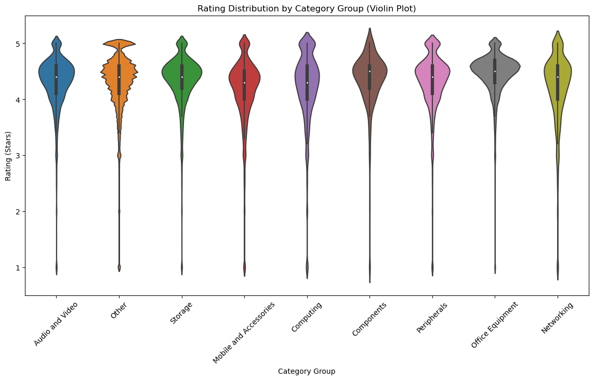
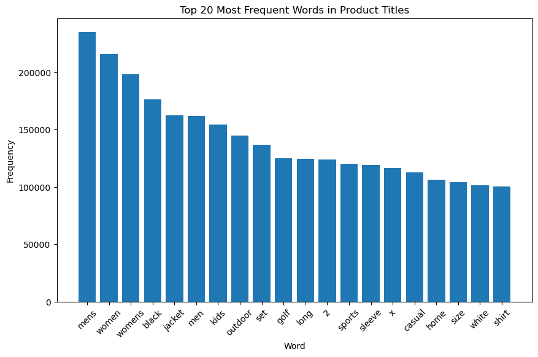
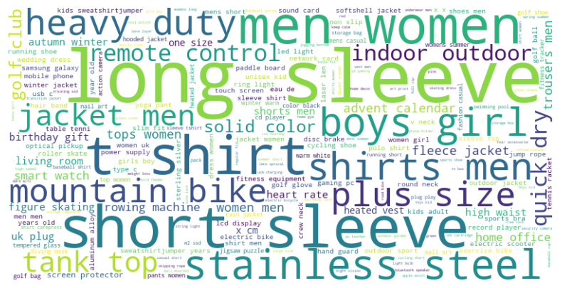

```python
# Loading the packages
import pandas as pd
import matplotlib.pyplot as plt
import seaborn as sns
import numpy as np
import nltk
nltk.download('punkt')
from collections import Counter
from nltk.tokenize import word_tokenize
import re
```

    [nltk_data] Downloading package punkt to
    [nltk_data]     C:\Users\vhv88\AppData\Roaming\nltk_data...
    [nltk_data]   Package punkt is already up-to-date!
    


```python
# Loading the dataset
try:
    df = pd.read_csv('amz_uk_processed_data.csv')
except pd.errors.ParserError as e:
    print(f"Error al leer el archivo: {e}")
```


```python
print(df.head())
```

             asin                                              title  \
    0  B09B96TG33  Echo Dot (5th generation, 2022 release) | Big ...   
    1  B01HTH3C8S  Anker Soundcore mini, Super-Portable Bluetooth...   
    2  B09B8YWXDF  Echo Dot (5th generation, 2022 release) | Big ...   
    3  B09B8T5VGV  Echo Dot with clock (5th generation, 2022 rele...   
    4  B09WX6QD65  Introducing Echo Pop | Full sound compact Wi-F...   
    
                                                  imgUrl  \
    0  https://m.media-amazon.com/images/I/71C3lbbeLs...   
    1  https://m.media-amazon.com/images/I/61c5rSxwP0...   
    2  https://m.media-amazon.com/images/I/61j3SEUjMJ...   
    3  https://m.media-amazon.com/images/I/71yf6yTNWS...   
    4  https://m.media-amazon.com/images/I/613dEoF9-r...   
    
                                   productURL  stars  reviews  price  \
    0  https://www.amazon.co.uk/dp/B09B96TG33    4.7    15308  21.99   
    1  https://www.amazon.co.uk/dp/B01HTH3C8S    4.7    98099  23.99   
    2  https://www.amazon.co.uk/dp/B09B8YWXDF    4.7    15308  21.99   
    3  https://www.amazon.co.uk/dp/B09B8T5VGV    4.7     7205  31.99   
    4  https://www.amazon.co.uk/dp/B09WX6QD65    4.6     1881  17.99   
    
       isBestSeller  boughtInLastMonth    categoryName  
    0         False                  0  Hi-Fi Speakers  
    1          True                  0  Hi-Fi Speakers  
    2         False                  0  Hi-Fi Speakers  
    3         False                  0  Hi-Fi Speakers  
    4         False                  0  Hi-Fi Speakers  
    


```python
print(df.info())
```

    <class 'pandas.core.frame.DataFrame'>
    RangeIndex: 2222742 entries, 0 to 2222741
    Data columns (total 10 columns):
     #   Column             Dtype  
    ---  ------             -----  
     0   asin               object 
     1   title              object 
     2   imgUrl             object 
     3   productURL         object 
     4   stars              float64
     5   reviews            int64  
     6   price              float64
     7   isBestSeller       bool   
     8   boughtInLastMonth  int64  
     9   categoryName       object 
    dtypes: bool(1), float64(2), int64(2), object(5)
    memory usage: 154.7+ MB
    None
    


```python
# Explorating the data / Excluding the values with 0 Reviews*quiero llamar a la v
df_filtered_reviews = df[df['reviews'] > 0]
```


```python
# Plot a histogram of 'stars/ratings' using the filtered dataframe
sns.histplot(df_filtered_reviews['stars'], kde=True)  # Create a histogram with kernel density estimation
plt.title('Rating distribution')  # Set the title of the plot
plt.xlabel('Rating (Stars)')  # Set the label for the x-axis
plt.ylabel('# of ratings')  # Set the label for the y-axis
plt.show()  # Display the plot
```


    

    


```python
# Analyzing potential correlations
correlation_matrix = df_filtered_reviews[['stars', 'reviews', 'price']].corr()
sns.heatmap(correlation_matrix, annot=True)
plt.title('Correlation Matrix')
plt.show()
```


    

    


```python
#This correlation graph shows that there is no strong linear relationship between the ratings (stars),
# the number of reviews (reviews) and the price (price) of the products or services being analyzed.
```


```python
# Grouping the categories in to more indexed ones
def categorize_category(category_name):
    """
    Function to categorize a given category name into broader groups based on predefined rules.
    
    Parameters:
    - category_name: The name of the category to be categorized.
    
    Returns:
    - A string representing the broader category group.
    """
    # Convert category name to lowercase for case-insensitive matching
    category_lower = category_name.lower()
    
    # Define rules for categorization based on keywords
    if 'comput' in category_lower or 'laptop' in category_lower or 'desktop' in category_lower or 'tablet' in category_lower:
        return 'Computing'
    elif 'peripheral' in category_lower or 'mouse' in category_lower or 'keyboard' in category_lower or 'printer' in category_lower:
        return 'Peripherals'
    elif 'softwar' in category_lower or 'applicat' in category_lower or 'operating system' in category_lower:
        return 'Software'
    elif 'mobile' in category_lower or 'phone' in category_lower or 'smartphone' in category_lower or 'case' in category_lower:
        return 'Mobile and Accessories'
    elif 'audio' in category_lower or 'video' in category_lower or 'speaker' in category_lower or 'headphone' in category_lower:
        return 'Audio and Video'
    elif 'network' in category_lower or 'router' in category_lower or 'wi-fi' in category_lower:
        return 'Networking'
    elif 'storage' in category_lower or 'hard drive' in category_lower or 'usb' in category_lower or 'memory card' in category_lower:
        return 'Storage'
    elif 'component' in category_lower or 'cpu' in category_lower or 'gpu' in category_lower or 'motherboard' in category_lower or 'ram' in category_lower:
        return 'Components'
    elif 'office' in category_lower or 'chair' in category_lower or 'desk' in category_lower or 'stationery' in category_lower:
        return 'Office Equipment'
    else:
        return 'Other'
```


```python
# Apply the categorization function to create a new column in the DataFrame
df['categoryGroup'] = df['categoryName'].apply(categorize_category)
df_filtered_reviews = df[df['reviews'] > 0]
```


```python
# Sub plot graph
# Setting the graph size
plt.figure(figsize=(14, 7))

# Iterate over each group of categories and create a subplot for each one
for i, group in enumerate(df['categoryGroup'].unique(), start=1):
    plt.subplot(3, 3, i)  # Ajusta el número de filas y columnas según la cantidad de grupos
    sns.boxplot(x='categoryGroup', y='stars', data=df[df['categoryGroup'] == group])
    plt.title(f'Rating Distribution for {group}')  # Título del subplot
    plt.xlabel('Category Group')  # Etiqueta del eje x
    plt.ylabel('Rating (Stars)')  # Etiqueta del eje y

# Adjusting the dessign of the subplots
plt.tight_layout()

# Showing the graph
plt.show()
```


    

    


```python
# Violing graph 
plt.figure(figsize=(14, 7))
sns.violinplot(x='categoryGroup', y='stars', data=df_filtered_reviews)
plt.xticks(rotation=45)  # Ajusta esto según sea necesario
plt.title('Rating Distribution by Category Group (Violin Plot)')
plt.xlabel('Category Group')
plt.ylabel('Rating (Stars)')
plt.show()
```


    

    


```python
# Calculate key statistics by grouped category
category_stats = df_filtered_reviews.groupby('categoryGroup')['stars'].describe()

# Select statistics of interest (you can adjust this to your needs)
category_stats = category_stats[['count', 'mean', '50%', 'min', 'max']]

# Rename columns for clarity
category_stats.rename(columns={'count': 'Reviews', 'mean': 'Average Rating', '50%': 'Median', 'min': 'Min Rating', 'max': 'Max Rating'}, inplace=True)

# Show the table
print(category_stats)
```

                             Reviews  Average Rating  Median  Min Rating  \
    categoryGroup                                                          
    Audio and Video          25460.0        4.300456     4.4         1.0   
    Components                1101.0        4.336149     4.5         1.0   
    Computing                16921.0        4.211920     4.3         1.0   
    Mobile and Accessories   31784.0        4.153725     4.3         1.0   
    Networking                7272.0        4.204414     4.4         1.0   
    Office Equipment         20305.0        4.455454     4.5         1.0   
    Other                   898944.0        4.312545     4.4         1.0   
    Peripherals              20099.0        4.311369     4.4         1.0   
    Storage                  26436.0        4.324932     4.4         1.0   
    
                            Max Rating  
    categoryGroup                       
    Audio and Video                5.0  
    Components                     5.0  
    Computing                      5.0  
    Mobile and Accessories         5.0  
    Networking                     5.0  
    Office Equipment               5.0  
    Other                          5.0  
    Peripherals                    5.0  
    Storage                        5.0  
    


```python
"""
- Key Insights 
Reviews Variation: There is a significant variation in the number of reviews between categories. The "Other" category stands out with a much higher number of reviews than the other categories, which could suggest that it is a general category that groups a wide range of products or is the most popular.

Average Rating: Average ratings vary between approximately 4.2 and 4.5, indicating generally positive ratings in all categories. The “Office Equipment” category has the highest average rating (around 4.45), which could imply higher customer satisfaction in this category.

Median Rating: The median in all categories is equal to or very close to the average, and is not less than 4.3, which reaffirms the trend of positive ratings. The closeness between the mean and the median may indicate a symmetrical distribution of scores, without significant bias toward high or low scores.

Rating Extremes: The fact that the minimum rating is 1 and the maximum is 5 in all categories means that each category has both the lowest and the highest rating, showing a wide range of customer satisfaction.
"""
```


    '\n- Key Insights \nReviews Variation: There is a significant variation in the number of reviews between categories. The "Other" category stands out with a much higher number of reviews than the other categories, which could suggest that it is a general category that groups a wide range of products or is the most popular.\n\nAverage Rating: Average ratings vary between approximately 4.2 and 4.5, indicating generally positive ratings in all categories. The “Office Equipment” category has the highest average rating (around 4.45), which could imply higher customer satisfaction in this category.\n\nMedian Rating: The median in all categories is equal to or very close to the average, and is not less than 4.3, which reaffirms the trend of positive ratings. The closeness between the mean and the median may indicate a symmetrical distribution of scores, without significant bias toward high or low scores.\n\nRating Extremes: The fact that the minimum rating is 1 and the maximum is 5 in all categories means that each category has both the lowest and the highest rating, showing a wide range of customer satisfaction.\n'


```python
### Análisis de palabras clave en los títulos de productos:


import re
from nltk.tokenize import word_tokenize
from collections import Counter

# Defining key words to remove
stopwords = ['a', 'the', 'and', 'of', 'in', 'on', 'for', 'with', 'to', 'from', ...]  # Asegúrate de añadir más stopwords relevantes aquí

# Tokenización de los títulos
tokens = []
for title in df['title']:
    title = re.sub(r'[^\w\s]', '', title)  # Elimina todos los símbolos excepto letras y espacios
    title_tokens = word_tokenize(title.lower())  # Tokeniza y convierte a minúsculas
    cleaned_tokens = [token for token in title_tokens if token not in stopwords]  # Filtra las palabras comunes
    tokens.extend(cleaned_tokens)  # Extiende la lista de tokens

# Eliminación de palabras comunes
stopwords = ['a', 'the', 'and', 'of', 'in', 'on', 'for', 'with', 'to', 'from']  # Lista de palabras comunes a eliminar
filtered_tokens = [word for word in tokens if word not in stopwords]

# Recuento de palabras
word_counts = Counter(filtered_tokens)

# Convertir el recuento de palabras en un DataFrame para facilitar la visualización
word_counts_df = pd.DataFrame(word_counts.items(), columns=['Word', 'Frequency'])

# Ordenar las palabras por frecuencia
word_counts_df = word_counts_df.sort_values(by='Frequency', ascending=False)

# Visualización de las palabras clave
plt.figure(figsize=(10, 6))
plt.bar(word_counts_df['Word'][:20], word_counts_df['Frequency'][:20])
plt.xlabel('Word')
plt.ylabel('Frequency')
plt.title('Top 20 Most Frequent Words in Product Titles')
plt.xticks(rotation=45)
plt.show()
```


    

    


```python
# Making a word cloud with the results
# Installing library
!pip install wordcloud

from wordcloud import WordCloud

# Combining all the words in a single string
text = ' '.join(filtered_tokens)

# Creating the wordCloud
wordcloud = WordCloud(width=800, height=400, background_color='white').generate(text)

# Showing it
plt.figure(figsize=(10, 5))
plt.imshow(wordcloud, interpolation='bilinear')
plt.axis('off')  # No mostrar los ejes para una visualización más limpia
plt.show()
```

    Requirement already satisfied: wordcloud in c:\users\vhv88\anaconda3\lib\site-packages (1.9.3)
    Requirement already satisfied: numpy>=1.6.1 in c:\users\vhv88\anaconda3\lib\site-packages (from wordcloud) (1.24.3)
    Requirement already satisfied: pillow in c:\users\vhv88\anaconda3\lib\site-packages (from wordcloud) (9.4.0)
    Requirement already satisfied: matplotlib in c:\users\vhv88\anaconda3\lib\site-packages (from wordcloud) (3.7.1)
    Requirement already satisfied: contourpy>=1.0.1 in c:\users\vhv88\anaconda3\lib\site-packages (from matplotlib->wordcloud) (1.0.5)
    Requirement already satisfied: cycler>=0.10 in c:\users\vhv88\anaconda3\lib\site-packages (from matplotlib->wordcloud) (0.11.0)
    Requirement already satisfied: fonttools>=4.22.0 in c:\users\vhv88\anaconda3\lib\site-packages (from matplotlib->wordcloud) (4.25.0)
    Requirement already satisfied: kiwisolver>=1.0.1 in c:\users\vhv88\anaconda3\lib\site-packages (from matplotlib->wordcloud) (1.4.4)
    Requirement already satisfied: packaging>=20.0 in c:\users\vhv88\anaconda3\lib\site-packages (from matplotlib->wordcloud) (23.0)
    Requirement already satisfied: pyparsing>=2.3.1 in c:\users\vhv88\anaconda3\lib\site-packages (from matplotlib->wordcloud) (3.0.9)
    Requirement already satisfied: python-dateutil>=2.7 in c:\users\vhv88\anaconda3\lib\site-packages (from matplotlib->wordcloud) (2.8.2)
    Requirement already satisfied: six>=1.5 in c:\users\vhv88\anaconda3\lib\site-packages (from python-dateutil>=2.7->matplotlib->wordcloud) (1.16.0)
    


    

    


```python
"""
Highlighted Words: Words like "men", "women", "jacket", "size", "shirt", "shorts", "sleeve", and "outdoor" are prominent, suggesting that these are frequent terms and possibly important categories or attributes in product titles.

Focus on Fashion and Accessories: The presence of words such as "jacket", "shirt", "shorts", "sleeve", "top", and "dress" indicates that a significant portion of the products may be related to clothing or fashion.

Products for Both Genders: The appearance of "men" and "women" suggests that the products are targeted towards both genders, and there seems to be a balance in the quantity of products directed at each.

Outdoor Usage Products: The word "outdoor" implies that many products are intended for outdoor use, which could include outerwear, sports equipment, or accessories for outdoor activities.

Product Variety: The presence of varied terms such as "mountain", "bike", "heart rate", "stainless steel" suggests a diversity in the type of products, possibly including sports items, technological gadgets, and kitchen utensils.
"""
```


    '\nHighlighted Words: Words like "men", "women", "jacket", "size", "shirt", "shorts", "sleeve", and "outdoor" are prominent, suggesting that these are frequent terms and possibly important categories or attributes in product titles.\n\nFocus on Fashion and Accessories: The presence of words such as "jacket", "shirt", "shorts", "sleeve", "top", and "dress" indicates that a significant portion of the products may be related to clothing or fashion.\n\nProducts for Both Genders: The appearance of "men" and "women" suggests that the products are targeted towards both genders, and there seems to be a balance in the quantity of products directed at each.\n\nOutdoor Usage Products: The word "outdoor" implies that many products are intended for outdoor use, which could include outerwear, sports equipment, or accessories for outdoor activities.\n\nProduct Variety: The presence of varied terms such as "mountain", "bike", "heart rate", "stainless steel" suggests a diversity in the type of products, possibly including sports items, technological gadgets, and kitchen utensils.\n'


```python
# Code for analisis price by keywords
df['price'] = pd.to_numeric(df['price'], errors='coerce')

keywords = ['premium', 'luxury', 'portable', 'electronic', 'gaming', 'wireless'] 

price_stats = {}

for keyword in keywords:
    # Filtering the DataFrame by title that contains the keyword
    keyword_df = df[df['title'].str.contains(keyword, case=False, na=False)]
    # Calculating descriptive statistics
    price_stats[keyword] = keyword_df['price'].describe()

# Converting the dictionary of statistics in to a Dataframe for a better visualization
price_stats_df = pd.DataFrame(price_stats).T

print(price_stats_df)
```

                  count        mean         std   min    25%     50%       75%  \
    premium     19486.0   89.269340  290.889487  0.16   9.90  18.005   41.9975   
    luxury       7034.0  130.673665  426.464312  0.99  13.95  27.990   79.8975   
    portable    80373.0  163.053207  405.032502  0.01  14.02  30.490  130.9900   
    electronic  13670.0  106.800229  371.289193  0.01  11.99  25.990   78.5800   
    gaming      26499.0  445.090823  666.994895  0.01  19.99  73.450  832.9200   
    wireless    47093.0   95.868577  259.029818  0.01  15.99  29.990   84.2200   
    
                     max  
    premium     19990.00  
    luxury      10499.73  
    portable     9580.23  
    electronic  11680.40  
    gaming      13281.07  
    wireless    10499.73  
    
