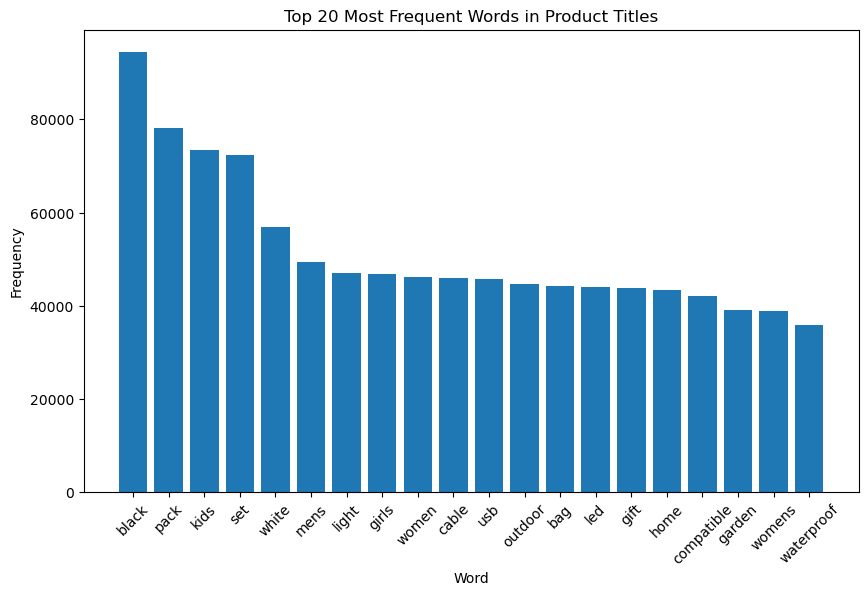

# **Navigating the Amazon UK Product Ocean: An In-depth Analysis of Consumer Trends and Preferences**


```python
# Loading the packages/libraries
import pandas as pd
import matplotlib.pyplot as plt
import seaborn as sns
import numpy as np
import nltk
nltk.download('punkt')
from collections import Counter
from nltk.tokenize import word_tokenize
import re
```

```python
# Loading the dataset
try:
    df = pd.read_csv('amz_uk_processed_data.csv')
except pd.errors.ParserError as e:
    print(f"Error al leer el archivo: {e}")
```

#### Previewing the DataFrame structure


```python
print(df.head())
```

             asin                                              title  \
    0  B09B96TG33  Echo Dot (5th generation, 2022 release) | Big ...   
    1  B01HTH3C8S  Anker Soundcore mini, Super-Portable Bluetooth...   
    2  B09B8YWXDF  Echo Dot (5th generation, 2022 release) | Big ...   
    3  B09B8T5VGV  Echo Dot with clock (5th generation, 2022 rele...   
    4  B09WX6QD65  Introducing Echo Pop | Full sound compact Wi-F...   
    
                                                  imgUrl  \
    0  https://m.media-amazon.com/images/I/71C3lbbeLs...   
    1  https://m.media-amazon.com/images/I/61c5rSxwP0...   
    2  https://m.media-amazon.com/images/I/61j3SEUjMJ...   
    3  https://m.media-amazon.com/images/I/71yf6yTNWS...   
    4  https://m.media-amazon.com/images/I/613dEoF9-r...   
    
                                   productURL  stars  reviews  price  \
    0  https://www.amazon.co.uk/dp/B09B96TG33    4.7    15308  21.99   
    1  https://www.amazon.co.uk/dp/B01HTH3C8S    4.7    98099  23.99   
    2  https://www.amazon.co.uk/dp/B09B8YWXDF    4.7    15308  21.99   
    3  https://www.amazon.co.uk/dp/B09B8T5VGV    4.7     7205  31.99   
    4  https://www.amazon.co.uk/dp/B09WX6QD65    4.6     1881  17.99   
    
       isBestSeller  boughtInLastMonth    categoryName    categoryGroup  premium  \
    0         False                  0  Hi-Fi Speakers  Audio and Video    False   
    1          True                  0  Hi-Fi Speakers  Audio and Video    False   
    2         False                  0  Hi-Fi Speakers  Audio and Video    False   
    3         False                  0  Hi-Fi Speakers  Audio and Video    False   
    4         False                  0  Hi-Fi Speakers  Audio and Video    False   
    
       luxury  portable  electronic  gaming  wireless  
    0   False     False       False   False     False  
    1   False      True       False   False      True  
    2   False     False       False   False     False  
    3   False     False       False   False     False  
    4   False     False       False   False     False  
    


```python
print(df.info())
```

    <class 'pandas.core.frame.DataFrame'>
    Int64Index: 1048322 entries, 0 to 2222741
    Data columns (total 17 columns):
     #   Column             Non-Null Count    Dtype  
    ---  ------             --------------    -----  
     0   asin               1048322 non-null  object 
     1   title              1048322 non-null  object 
     2   imgUrl             1048322 non-null  object 
     3   productURL         1048322 non-null  object 
     4   stars              1048322 non-null  float64
     5   reviews            1048322 non-null  int64  
     6   price              1048322 non-null  float64
     7   isBestSeller       1048322 non-null  bool   
     8   boughtInLastMonth  1048322 non-null  int64  
     9   categoryName       1048322 non-null  object 
     10  categoryGroup      1048322 non-null  object 
     11  premium            1048322 non-null  bool   
     12  luxury             1048322 non-null  bool   
     13  portable           1048322 non-null  bool   
     14  electronic         1048322 non-null  bool   
     15  gaming             1048322 non-null  bool   
     16  wireless           1048322 non-null  bool   
    dtypes: bool(7), float64(2), int64(2), object(6)
    memory usage: 95.0+ MB
    None
    


```python
# Explorating the data / Excluding the values with 0 Reviews.
df_filtered_reviews = df[df['reviews'] > 0]
```

## **How are product ratings distributed across Amazon UK?**


```python
# Histogram of 'stars/ratings' using the filtered dataframe
sns.histplot(df_filtered_reviews['stars'], kde=True)  # Create a histogram with kernel density estimation
plt.title('Rating distribution')  # Set the title of the plot
plt.xlabel('Rating (Stars)')  # Set the label for the x-axis
plt.ylabel('# of ratings')  # Set the label for the y-axis
plt.show()  # Display the plot
```


    

    


*Concentration of Ratings*: There appears to be a concentration of ratings at the **higher end** of the scale, particularly around the 4.0 to 5.0 star range. This suggests a generally positive reception of products.

*Skewness*: The distribution is likely left-skewed, indicating that there are fewer low ratings and that lower ratings are **less frequent**.

*Popular Ratings*: The mode of the ratings seems to be at or close to 5.0 stars, which is the highest possible rating, indicating that this is the **most common rating given**.

*Quality Indication*: The fact that the majority of ratings are high could imply that customers are **generally satisfied** with their purchases, or it could suggest a possible *bias* in which customers are more likely to rate a product if they have a positive experience.

## **Is there a relationship between product prices, ratings, and the number of reviews?**


```python
# Analyzing potential correlations
correlation_matrix = df_filtered_reviews[['stars', 'reviews', 'price']].corr()
sns.heatmap(correlation_matrix, annot=True)
plt.title('Correlation Matrix')
plt.show()
```


    

    


This correlation graph shows that there is **no strong linear relationship** between the ratings (stars), the number of reviews (reviews) and the price (price) of the products or services being analyzed.


```python
# Grouping the categories in to more indexed ones
def categorize_category(category_name):
    """
    Function to categorize a given category name into broader groups based on predefined rules.
    
    Parameters:
    - category_name: The name of the category to be categorized.
    
    Returns:
    - A string representing the broader category group.
    """
    # Converting category name to lowercase for case-insensitive matching
    category_lower = category_name.lower()
    
    # Define rules for categorization based on keywords
    if 'comput' in category_lower or 'laptop' in category_lower or 'desktop' in category_lower or 'tablet' in category_lower:
        return 'Computing'
    elif 'peripheral' in category_lower or 'mouse' in category_lower or 'keyboard' in category_lower or 'printer' in category_lower:
        return 'Peripherals'
    elif 'softwar' in category_lower or 'applicat' in category_lower or 'operating system' in category_lower:
        return 'Software'
    elif 'mobile' in category_lower or 'phone' in category_lower or 'smartphone' in category_lower or 'case' in category_lower:
        return 'Mobile and Accessories'
    elif 'audio' in category_lower or 'video' in category_lower or 'speaker' in category_lower or 'headphone' in category_lower:
        return 'Audio and Video'
    elif 'network' in category_lower or 'router' in category_lower or 'wi-fi' in category_lower:
        return 'Networking'
    elif 'storage' in category_lower or 'hard drive' in category_lower or 'usb' in category_lower or 'memory card' in category_lower:
        return 'Storage'
    elif 'component' in category_lower or 'cpu' in category_lower or 'gpu' in category_lower or 'motherboard' in category_lower or 'ram' in category_lower:
        return 'Components'
    elif 'office' in category_lower or 'chair' in category_lower or 'desk' in category_lower or 'stationery' in category_lower:
        return 'Office Equipment'
    elif any(term in category_lower for term in ['woman', 'man', 'women', 'men', 'mans', 'womans', 'jacket', 'trousers', 'pants', 'shirt', 'dress', 'clothing', 'apparel']):
        return 'Clothing and Apparel'
    else:
        return 'Other'
```


```python
# Applying the categorization function to create a new column in the DataFrame
df['categoryGroup'] = df['categoryName'].apply(categorize_category)
df_filtered_reviews = df[df['reviews'] > 0]
```

## **How do product ratings vary across different categories on Amazon UK?**


```python
# Determining the number of unique categories
unique_categories = df['categoryGroup'].unique()
n_categories = len(unique_categories)

# Calculating the number of rows and columns needed for the subplots
n_cols = 2
n_rows = n_categories // n_cols + (n_categories % n_cols > 0)

# Setting the graph size dynamically based on the number of subplots
plt.figure(figsize=(14, n_rows * 4))  # Height of each row is 4

# Iterate over each group of categories and create a subplot for each one
for i, group in enumerate(unique_categories, start=1):
    plt.subplot(n_rows, n_cols, i)
    sns.boxplot(x='categoryGroup', y='stars', data=df[df['categoryGroup'] == group])
    plt.title(f'Rating Distribution for {group}')
    plt.xlabel('Category Group')
    plt.ylabel('Rating (Stars)')

# Adjusting the design of the subplots to prevent overlap
plt.tight_layout()

# Showing the graph
plt.show()
```


    

    


*Consistently High Ratings*: All categories show a concentration of ratings above the 4-star mark, indicating *general customer satisfaction* across the board.

*Presence of Outliers*: Categories like "Audio and Video" and "Office Equipment" have outliers that are rated significantly *lower* than the bulk of the products. These could represent specific items that are not meeting customer expectations.

*Variation within Categories*: While most categories have a tight interquartile range, indicating consistency in ratings, "Office Equipment" shows more variation in ratings, which could suggest a wider range of product satisfaction.

*Similarity Across Categories*: The similarity in the shape of the distributions across different categories suggests that customer satisfaction *does not vary dramatically* across these category groups.

## **What is the variability in product ratings among different category groups?**


```python
# Violing graph 
plt.figure(figsize=(14, 7))
sns.violinplot(x='categoryGroup', y='stars', data=df_filtered_reviews)
plt.xticks(rotation=45)  # Ajusta esto según sea necesario
plt.title('Rating Distribution by Category Group (Violin Plot)')
plt.xlabel('Category Group')
plt.ylabel('Rating (Stars)')
plt.show()
```


    

    


*General Satisfaction*: The ratings across all categories predominantly hover around the 4 to 5-star range, implying **high customer satisfaction**.

*Distribution Shape*: Categories such as "Other" and "Clothing and Apparel" have wider distributions at the top, indicating a variety of high ratings.

*Rating Consistency*: Categories like "**Computing**" and "**Components**" show narrow peaks at the higher ratings, suggesting **consistency in high ratings**.

*Lower Rating Instances*: Some categories exhibit long tails toward the lower ratings, which may point to a few products with significantly **lower satisfaction**.

*Variability*: "Office Equipment" shows a wider distribution across the rating spectrum, suggesting a more **variable customer experience**.

## **Key Statistics**


```python
# Calculate key statistics by grouped category
category_stats = df_filtered_reviews.groupby('categoryGroup')['stars'].describe()

# Selecting statistics of interest 
category_stats = category_stats[['count', 'mean', '50%', 'min', 'max']]

# Renaming columns for clarity
category_stats.rename(columns={'count': 'Reviews', 'mean': 'Average Rating', '50%': 'Median', 'min': 'Min Rating', 'max': 'Max Rating'}, inplace=True)

# Showing the table
print(category_stats)
```

                             Reviews  Average Rating  Median  Min Rating  \
    categoryGroup                                                          
    Audio and Video          25460.0        4.300456     4.4         1.0   
    Clothing and Apparel     98998.0        4.263813     4.3         1.0   
    Components                1101.0        4.336149     4.5         1.0   
    Computing                16921.0        4.211920     4.3         1.0   
    Mobile and Accessories   31784.0        4.153725     4.3         1.0   
    Networking                7272.0        4.204414     4.4         1.0   
    Office Equipment         20305.0        4.455454     4.5         1.0   
    Other                   799946.0        4.318576     4.4         1.0   
    Peripherals              20099.0        4.311369     4.4         1.0   
    Storage                  26436.0        4.324932     4.4         1.0   
    
                            Max Rating  
    categoryGroup                       
    Audio and Video                5.0  
    Clothing and Apparel           5.0  
    Components                     5.0  
    Computing                      5.0  
    Mobile and Accessories         5.0  
    Networking                     5.0  
    Office Equipment               5.0  
    Other                          5.0  
    Peripherals                    5.0  
    Storage                        5.0  
    

### Key Insights 
*Review Variations*: The disparity in the number of reviews across categories remains evident. Notably, "Clothing and Apparel" has emerged with a **high volume of reviews**, rivalling the "Other" category, which may indicate a collective interest or a broad array of products within these groups.

*Average Rating Consistency*: The average ratings are consistently positive across categories, falling **between 4.2 to 4.5**, reinforcing the trend of general customer satisfaction. "Office Equipment" still maintains the highest average rating, which speaks to customer contentment within this segment.

*Median Ratings*: The median ratings align closely with the averages, none dipping below 4.3. This alignment suggests **balanced distributions** with no pronounced skewness toward lower ratings.

*Range of Ratings*: All categories showcase the full spectrum of ratings from 1 to 5 stars. The presence of both the lowest and highest possible ratings indicates **diverse consumer experiences and satisfaction levels**.

## **What are the most frequent words in product titles, and what do they reveal about market trends?**


```python
# Keyword Analysis in Product Titles

import re
from nltk.tokenize import word_tokenize
from collections import Counter

# Defining key words to remove
stopwords = ['a', 'the', 'and', 'of', 'in', 'on', 'for', 'with', 'to', 'from', '2', '1', 'x', '4', '3', '6', '7', '8', '9', '5']  

# Tokenization of the titles
tokens = []
for title in df['title']:
    title = re.sub(r'[^\w\s]', '', title)  # Elimina todos los símbolos excepto letras y espacios
    title_tokens = word_tokenize(title.lower())  # Tokeniza y convierte a minúsculas
    cleaned_tokens = [token for token in title_tokens if token not in stopwords]  # Filtra las palabras comunes
    tokens.extend(cleaned_tokens)  # Extiende la lista de tokens

# Removing common words
stopwords = ['a', 'the', 'and', 'of', 'in', 'on', 'for', 'with', 'to', 'from']  # Lista de palabras comunes a eliminar
filtered_tokens = [word for word in tokens if word not in stopwords]

# Word recount
word_counts = Counter(filtered_tokens)

# Transforming the recount in to a Dataframe for easier Visualization
word_counts_df = pd.DataFrame(word_counts.items(), columns=['Word', 'Frequency'])

# Ordering the words by frequency
word_counts_df = word_counts_df.sort_values(by='Frequency', ascending=False)

# Creating the visualization
plt.figure(figsize=(10, 6))
plt.bar(word_counts_df['Word'][:20], word_counts_df['Frequency'][:20])
plt.xlabel('Word')
plt.ylabel('Frequency')
plt.title('Top 20 Most Frequent Words in Product Titles')
plt.xticks(rotation=45)
plt.show()
```


    

    


*Popular Descriptors*: Words like "black," "pack," and "set" are among the most common, which may indicate a preference for products that are **versatile, come in multipacks, or are part of a set**.

*Color Preference*: The colors "black" and "white" are frequently mentioned, possibly pointing to a **popular color** scheme for products or a **general trend** in customer color preference.

*Gender-Specific Products*: The words "mens," "women," "girls," and "womens" suggest that products are often listed with a specific **target gender**, possibly in categories like clothing, accessories, or personal care.

*Product Types and Features*: Terms like "light," "cable," "usb," "outdoor," "led," and "waterproof" indicate common **product features** or types that are of interest to customers.

*Gift Items*: The appearance of the word "gift" implies that many products are being **marketed as gifts**, which could be especially prevalent in searches around holiday seasons or special occasions.

## **How does the presence of certain keywords in product titles correlate with the products' ratings and perceived premium quality on Amazon UK?**

### Making a word cloud with the results


```python
# Installing library
!pip install wordcloud

from wordcloud import WordCloud

# Combining all the words in a single string
text = ' '.join(filtered_tokens)

# Creating the wordCloud
wordcloud = WordCloud(width=800, height=400, background_color='white').generate(text)

# Showing it
plt.figure(figsize=(10, 5))
plt.imshow(wordcloud, interpolation='bilinear')
plt.axis('off')  # No mostrar los ejes para una visualización más limpia
plt.show()
```

    Requirement already satisfied: wordcloud in c:\users\vhv88\anaconda3\lib\site-packages (1.9.3)
    Requirement already satisfied: numpy>=1.6.1 in c:\users\vhv88\anaconda3\lib\site-packages (from wordcloud) (1.24.3)
    Requirement already satisfied: pillow in c:\users\vhv88\anaconda3\lib\site-packages (from wordcloud) (9.4.0)
    Requirement already satisfied: matplotlib in c:\users\vhv88\anaconda3\lib\site-packages (from wordcloud) (3.7.1)
    Requirement already satisfied: contourpy>=1.0.1 in c:\users\vhv88\anaconda3\lib\site-packages (from matplotlib->wordcloud) (1.0.5)
    Requirement already satisfied: cycler>=0.10 in c:\users\vhv88\anaconda3\lib\site-packages (from matplotlib->wordcloud) (0.11.0)
    Requirement already satisfied: fonttools>=4.22.0 in c:\users\vhv88\anaconda3\lib\site-packages (from matplotlib->wordcloud) (4.25.0)
    Requirement already satisfied: kiwisolver>=1.0.1 in c:\users\vhv88\anaconda3\lib\site-packages (from matplotlib->wordcloud) (1.4.4)
    Requirement already satisfied: packaging>=20.0 in c:\users\vhv88\anaconda3\lib\site-packages (from matplotlib->wordcloud) (23.0)
    Requirement already satisfied: pyparsing>=2.3.1 in c:\users\vhv88\anaconda3\lib\site-packages (from matplotlib->wordcloud) (3.0.9)
    Requirement already satisfied: python-dateutil>=2.7 in c:\users\vhv88\anaconda3\lib\site-packages (from matplotlib->wordcloud) (2.8.2)
    Requirement already satisfied: six>=1.5 in c:\users\vhv88\anaconda3\lib\site-packages (from python-dateutil>=2.7->matplotlib->wordcloud) (1.16.0)
    


    

    


*Diverse Product Features*: The prominence of words like "remote," "control," "living," "room," and "light" suggests a focus on *home electronics and furnishings*, with an emphasis on **convenience and comfort**.

*Fashion and Personal Items*: The frequent mention of "men," "women," "boys," "girls," along with specific items like "jacket" and "dress," highlights a **strong presence of clothing and personal accessories**.

*Technological Gadgets*: Terms such as "USB," "LED," and "Samsung Galaxy" indicate **popular interest in electronic devices and accessories**.

*Color Preferences*: "Black," "grey," "green," "blue," and "pink" appear often, which may reflect **common color choices** for products.

*Home and Lifestyle*: Words like "office," "home," "stainless," and "steel" imply a variety of products related to **home improvement and lifestyle goods**.

*Gift and Occasions*: The appearance of "birthday" and "gift" indicates that products are also frequently marketed for **special occasions**.

## **Price analysis by keywords**


```python
df['price'] = pd.to_numeric(df['price'], errors='coerce')

keywords = ['premium', 'luxury', 'portable', 'electronic', 'gaming', 'wireless'] 

price_stats = {}

for keyword in keywords:
    # Filtering the DataFrame by title that contains the keyword
    keyword_df = df[df['title'].str.contains(keyword, case=False, na=False)]
    # Calculating descriptive statistics
    price_stats[keyword] = keyword_df['price'].describe()

# Converting the dictionary of statistics in to a Dataframe for a better visualization
price_stats_df = pd.DataFrame(price_stats).T

print(price_stats_df)
```

                  count        mean         std   min    25%     50%       75%  \
    premium     19486.0   89.269340  290.889487  0.16   9.90  18.005   41.9975   
    luxury       7034.0  130.673665  426.464312  0.99  13.95  27.990   79.8975   
    portable    80373.0  163.053207  405.032502  0.01  14.02  30.490  130.9900   
    electronic  13670.0  106.800229  371.289193  0.01  11.99  25.990   78.5800   
    gaming      26499.0  445.090823  666.994895  0.01  19.99  73.450  832.9200   
    wireless    47093.0   95.868577  259.029818  0.01  15.99  29.990   84.2200   
    
                     max  
    premium     19990.00  
    luxury      10499.73  
    portable     9580.23  
    electronic  11680.40  
    gaming      13281.07  
    wireless    10499.73  
    

*Price Variance by Keyword*: There's significant variance in prices associated with certain keywords. '**Gaming' products have the highest average price and also the widest price range**, suggesting they include both affordable and high-end options.

*Luxury and Premium Connotations*: Both 'luxury' and 'premium' products have higher average prices than 'portable', 'electronic', and 'wireless', indicating these terms might be **associated with higher-end or quality products**.

*Wireless Accessibility*: Products with the keyword 'wireless' have a **lower average price** compared to 'gaming', 'luxury', and 'electronic', which could indicate a wider accessibility for wireless technology.

*Affordable Portability*: 'Portable' products have a **relatively low median price**, suggesting that while there are some high-priced portable items, many are affordable.

*High-End Electronics and Gaming*: The 'electronic' and 'gaming' categories have high maximum prices, indicating the presence of **premium products** in these categories.


```python

```
